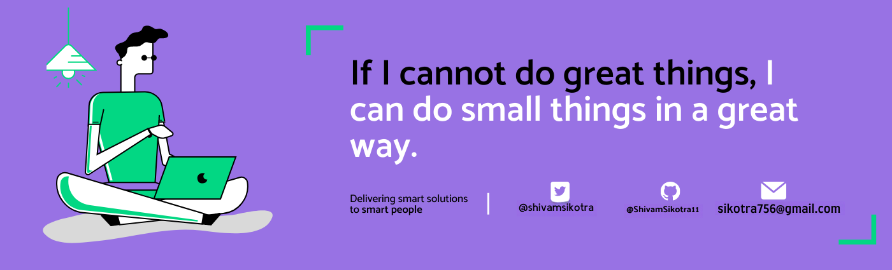

<h1 align="center">Hello I'm Shivam Sikotra</h1>

<!--
**ShivamSikotra11/ShivamSikotra11** is a ✨ _special_ ✨ repository because its `README.md` (this file) appears on your GitHub profile.
Here are some ideas to get you started: -->

<!-- 

  

 -->

 <!--   -->

## 👨🏻‍💻 About Me:

- 🎓 I’m `MongoDB Certified Associate Developer`
- 🌱 I’m `MERN Stack Developer`
- 👯 I’m looking to collaborate for `Dev Projects`
- 💬 Ask me about **DSA**,**CP**,**Machine Learning, Data Science, NLP, Deep Learning** Except **Maths** :sweat_smile:
- 📫 How to reach me - **sikotra756@gmail.com**

- 👨‍💻 Life Hack: Learn new tech :fire: and share what you have learned :tada:

- ⚡ Fun fact: I waste most of my time playing with LeetCode

## 🛠️ Technologies and Tools I use:

 

 

## ❤️ Let's get connected:

<!--     -->
<!--     -->
  

  
   

  
  
  

  

<!--
  
  
  -->

## 🤝 Support Me:

## 📊 GitHub Statistics:

    
    
  

